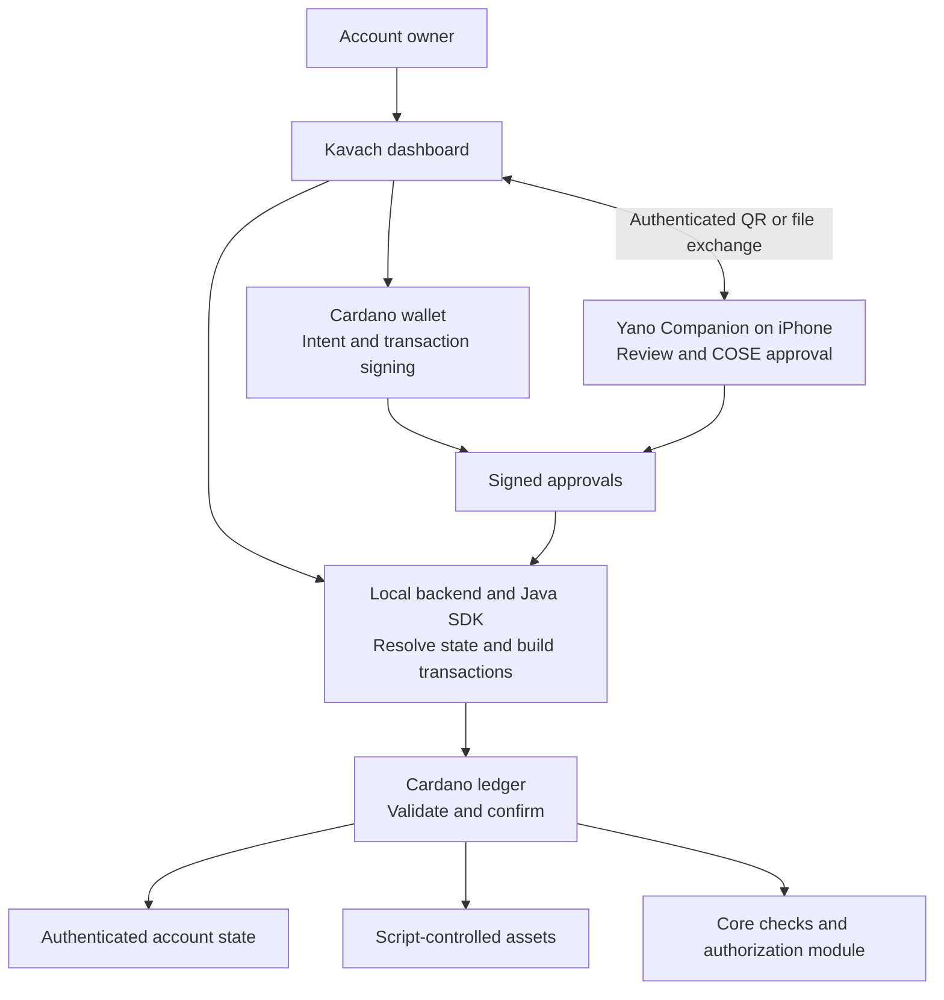
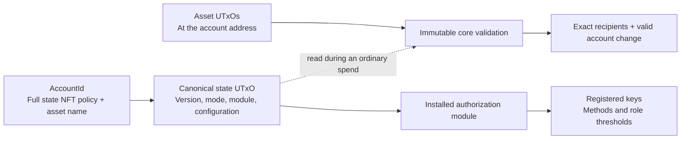
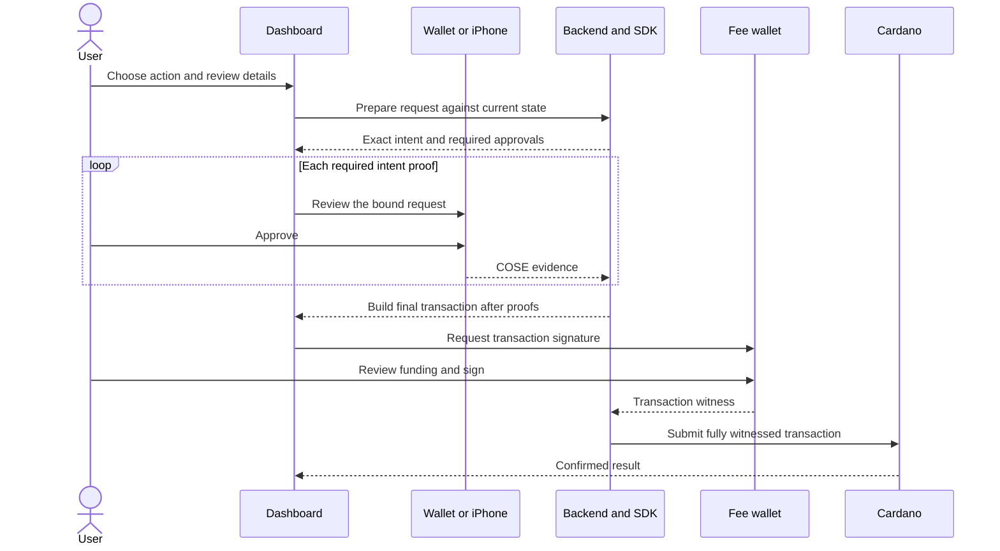
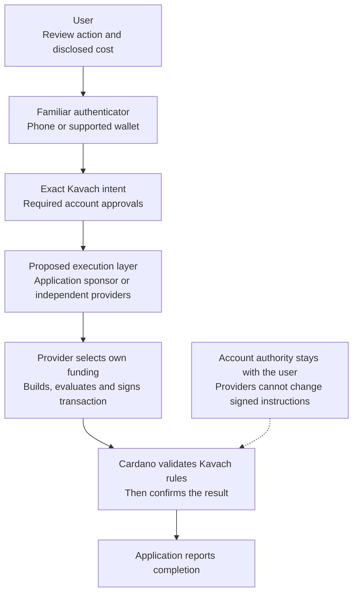
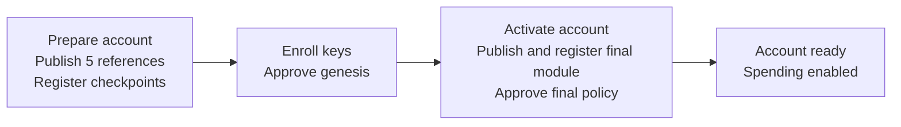
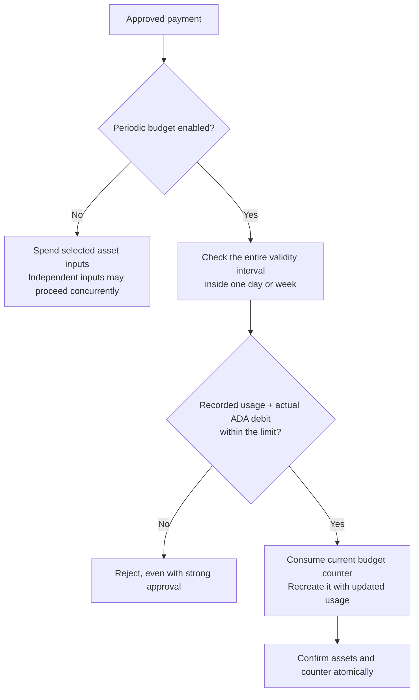
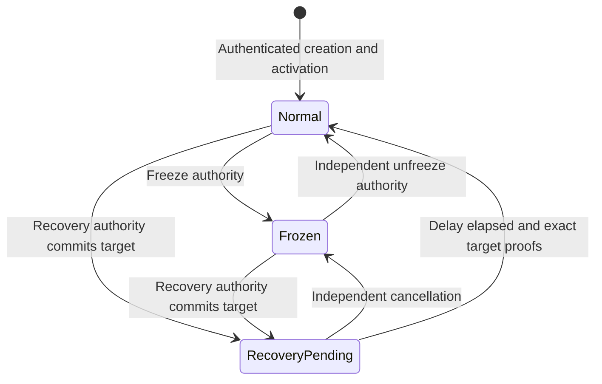

# Kavach
## Programmable accounts for Cardano

**Living white paper and technical specification · Version 0.1**

| Document control | Value |
| --- | --- |
| Status | Development draft; not an audited or production-qualified protocol |
| Last reviewed | 9 September 2026 |
| Implementation baseline | Kavach repository commit `f2b9420` |
| Intended readers | Account owners, wallet developers, protocol engineers and security reviewers |
| Maintained source | This Markdown document; diagrams are editable Mermaid source |
| Scope | Existing implementation, its qualification boundaries, and proposed next work |

> **The goal:** keep an account independent of any one device or signing key. Change who can authorize it, apply spending rules, and retain a separately controlled recovery path.
>
> **The present:** a working local Yaci DevKit development stack with contracts, Java SDK, dashboard, wallet signing and an iPhone companion. Transfers and policy workflows have ledger evidence. Recovery has implementation and partial evidence, but its full qualification remains open. Use test assets only.

Version **0.1 is this document's version**. It does not rename the on-chain schema, module ABI, signing schemes or deployed scripts.

### Reading routes

- **New to Kavach:** read sections 1–5, then the examples in section 7.
- **Building an integration:** read sections 6–10 and the source specifications in section 15.
- **Reviewing security:** start with sections 11–14 and follow the evidence links.

### Contents

1. [Purpose and vocabulary](#1-purpose-and-vocabulary)
2. [System overview](#2-system-overview)
3. [What exists today](#3-what-exists-today)
4. [The account model](#4-the-account-model)
5. [Signing and funding](#5-signing-and-funding)
6. [Creation and account changes](#6-creation-and-account-changes)
7. [Spending rules and budgets](#7-spending-rules-and-budgets)
8. [Lifecycle and recovery](#8-lifecycle-and-recovery)
9. [Technical profile](#9-technical-profile)
10. [Storage and restoration](#10-storage-and-restoration)
11. [Security model](#11-security-model)
12. [Privacy and device boundaries](#12-privacy-and-device-boundaries)
13. [Economics and areas to improve](#13-economics-and-areas-to-improve)
14. [Roadmap and release gates](#14-roadmap-and-release-gates)
15. [Specifications, evidence and maintenance](#15-specifications-evidence-and-maintenance)

---

## 1. Purpose and vocabulary

A conventional wallet often treats a payment key as the account. Kavach separates the account from the credentials that authorize it. Assets sit at a script-controlled Cardano address; the account's current rules decide which approvals permit an operation.

This enables policies such as: “My phone can approve a small ADA payment; larger payments also need my wallet key.” A different policy can control changes to those rules. A lost or replaced device need not imply a new account address when the change fits the existing immutable core.

Kavach is a **protocol and integration framework**. Its longer-term role can be an account foundation for applications, with replaceable providers handling transaction execution and fees behind a familiar approval experience (section 5.3). The dashboard is its reference management interface. Yano Wallet is its initial wallet integration, and Yano Companion supplies an independent iPhone signing key. Neither wallet brand is part of the on-chain authorization rule.

| Term | Plain meaning |
| --- | --- |
| Account | A script-controlled asset address, authenticated state and associated rules |
| UTxO | An unspent transaction output: a particular piece of ledger value that can be consumed once |
| State NFT | A unique asset identifying the account's canonical state; it is not a user's transferable membership token |
| Credential / key | A registered public key whose corresponding private key can approve certain operations |
| Intent | The exact, typed instruction being authorized, including its account and transaction constraints |
| Policy | Which registered keys must approve an operation, and the required threshold |
| Authorization module | On-chain code that checks the configured credentials and approval rules |
| Fee payer / sponsor | A wallet providing transaction funding and collateral where required |
| Locator | Public account-discovery information, useful for restoration; not a signing secret |
| Qualification | Evidence that a particular implementation/profile passed specified tests; not an independent audit |

**A visible balance is not a universal spendability guarantee.** Supported asset shapes, account mode, available approvals, transaction limits and funding all matter.

## 2. System overview



*Figure 1 — The current development stack. The backend builds transactions but does not hold account spending keys. Signing still requires a wallet or phone. The current phone exchange is local/offline; no remote relay is implemented.*

There are four distinct responsibilities:

| Layer | Responsibility |
| --- | --- |
| Immutable core | State identity and custody, allowed lifecycle changes, replay binding, transaction shape and value accounting |
| Authorization module | Determine whether the correct registered authorities approved the exact operation |
| SDK and backend | Resolve ledger data, prepare canonical requests, verify returned evidence, build/evaluate/submit transactions |
| Signer and interface | Present the requested action, obtain consent and produce signatures for supported profiles |

This separation helps prevent an authorization upgrade from silently replacing the rules that protect asset custody. It does not eliminate bugs in those rules or compromise of a signing device.

## 3. What exists today

Here, **implemented** means present in the development stack. **Live evidence** means specified transactions were accepted by the local DevKit ledger. Neither term means production readiness or comprehensive wallet compatibility.

| Capability | Existing behavior | Evidence / boundary |
| --- | --- | --- |
| Account creation | Authenticated state NFT, registered credentials, six authority policies | Live creation; current per-key flow has ten transactions |
| ADA transfers | Exact-input, signed recipient allocations and bounded account fee contribution | Compiled and live SDK/browser flows |
| Native assets | Bounded ordinary transfers; dedicated whole-UTxO path preserves the complete native-asset map | Live reference profiles; phone signing remains narrower |
| Consolidation | Combine supported account inputs into valid account change | Bounded builder/profile behavior; not arbitrary transaction composition |
| Per-key signing | COSE and transaction-witness methods in a mixed configuration | Compiled and live mixed/all-COSE flows |
| Dynamic creation signers | Add/remove controls, 3–8 keys in the dashboard | Eight-key creation tested; larger protocol registry is not a UI support claim |
| Amount tiers | Small ADA payments use one policy; larger/other transfers use the strong policy | Compiled and live tier selection |
| Optional periodic budget | Fixed daily or weekly ADA debit cap; enable/change/disable | Compiled boundary and live lifecycle/contention evidence |
| Credential and module changes | Existing administrators approve; destination/candidate proofs are checked | Live replacements and subsequent transfers |
| Freeze and unfreeze | Separate authorities and lifecycle checks | Compiled and short live flows; full race/recovery qualification open |
| Delayed recovery | Start, cancel and complete transition logic with target commitments and immutable timing | Compiled cases and short initiation/cancellation evidence; full real-delay completion qualification remains open |
| Workspace restoration | Multiple saved locators, switch/forget, authenticated state restoration | Browser and SDK tests; backend/provider trust remains |
| Approval wizard | Per-key progress, purpose grouping, device routing, separate funding phase | Browser checks and owner-observed DevKit use |
| iPhone approval | Device key, pairing, request review, response QR/file/JSON | Swift tests, builds and owner-observed signing; limited operations |
| Independent fee payer | Wallet outside the authority registry can fund an all-COSE request | Live synthetic-signer 15/35 ADA test |
| Positive reward accounting | Core/SDK receipt rules and historical positive-refund ledger tests | Current dashboard restricts itself to zero-reward checkpoints |

See the [policy ledger](../policy/completion-checklist.md), [browser ledger](../browser/completion-checklist.md), and [Phase 2 progress](../phase2/progress.md). Earlier ledger entries describe earlier snapshots; later increments add evidence without retrospectively qualifying old artifacts.

**Not currently delivered:** production deployment, a public sponsorship service, remote phone relay, generic dApp execution, arbitrary authentication algorithms, passkeys/YubiKey authorization, Google/Apple login authorization, CIP-113 programmable-token support, or fully qualified end-to-end recovery.

## 4. The account model



*Figure 2 — Identity is tied to authenticated state, not to whichever key is currently active. Ordinary asset spends reference state; state-changing operations consume and recreate it.*

The canonical state contains account/deployment identity, immutable core bindings, current module and configuration, state version, lifecycle mode, and recovery parameters/state. Finding a datum with the right-looking account ID is insufficient: validators and SDK restoration check the **complete NFT identity, quantity, custody address, schema and immutable bindings**.

Ordinary spending normally leaves the state UTxO unconsumed, allowing different asset inputs to be spent concurrently. State changes consume that state and increment its version, making requests against the former version stale.

| Change | Address consequence |
| --- | --- |
| Replace keys within a supported configuration | Account asset address remains unchanged |
| Change supported per-key signing methods under current administration | Same address; requires an on-chain configuration update |
| Replace a compatible authorization module | Same immutable account custody identity; current admin and candidate checks still apply |
| Add budget enforcement to an account created with the budget-capable core | Can be enabled using the supported module/configuration flow |
| Add budget capability to an ordinary core without it | Requires a new asset-validator profile/address and separately designed migration |
| Change immutable core code, parameters or compiler output | May change script hashes and addresses; never an automatic upgrade |

The current mutable-state implementation does not make archived sealed Phase 1 accounts upgradeable. Their historical state/reference deposits remain subject to their original scripts.

## 5. Signing and funding

### 5.1 Methods are configured, not guessed

The signing method belongs to each registered credential in a mixed account configuration. Evidence cannot choose a different method. A key is counted once per proof, regardless of how many addresses or devices expose it.

| Scheme | Meaning | Typical use |
| --- | --- | --- |
| 0 | Raw Ed25519 signature over the canonical intent digest | Original SDK/reference profile |
| 1 | Cardano transaction witnesses for named payment-key signers | Legacy/advanced browser transaction authorization |
| 2 | Bounded CIP-8-style COSE evidence over the exact digest | Wallet `signData` and supported Companion approvals |
| 3 | Mixed per-key methods with amount-tiered approval | Current dashboard's final per-key creation module |
| 4 | Mixed policy inside the optional periodic-budget configuration | Budget-capable account with periodic enforcement |

CIP-30 is the browser-wallet interface. In the dashboard, “transaction witness” means approving the final Cardano transaction via that interface. COSE is a signed-message format; wallets can provide it through `signData`. These are not two different kinds of account asset address chosen by a signature alone.

New dashboard keys default to **COSE intent approval**. Transaction-witness authorization remains an advanced choice. Existing accounts keep their on-chain methods until an authorized update confirms.

### 5.2 Approve, fund, confirm



*Figure 3 — Recommended all-COSE workflow. A transaction-witness authority profile additionally requires its authority witnesses on the final body.*

A COSE approval authorizes a request; it does not itself submit a transaction or pay fees. In an all-COSE account, the funding signature cannot replace any required COSE approval, even when the same wallet owns both keys.

A sponsor need not be an account authority. Sponsorship still needs a funded wallet, compatible transaction construction and explicit signing. A hosted sponsor service has not been built. Changing the sponsor in the current dashboard requires preparing a new request.

Keys derived at different HD address indexes can be distinct credentials. Yano's tested integration can discover matching address-index keys within a bounded search. Discovery belongs to the wallet, not the contract, and distinct keys under one seed do **not** provide independent protection against compromise of that seed.

### 5.3 Accounts as infrastructure: sponsored intent execution

**Proposed direction.** Kavach can become the account layer behind everyday applications: users choose an action and approve it with a familiar device, while an execution provider handles the blockchain mechanics. That provider could be an application-funded sponsor, an independently chosen operator, or a participant in a decentralized intent network.

The simple experience is **“Review → Approve → Done.”** A user might approve “Send 15 ADA to this recipient; network fee paid by the application” on their phone. They need not maintain a separate fee balance, select collateral or sign a second fee-wallet prompt. The provider still pays and signs the required funding transaction. Account policies still determine how many authority approvals are needed.



*Figure 4 — Proposed sponsored execution. Users authorize the action; providers supply execution and funding. The current local fee-payer primitive exists, but a decentralized execution network does not.*

This could make Kavach a reusable account foundation across applications. **The account is the durable authority layer; the execution network is replaceable infrastructure.** A network operator should not become a privileged key, control recovery, or dictate where the account can be used.

#### What the network would do

| Responsibility | Proposed provider behavior | What stays with the account/user |
| --- | --- | --- |
| Discovery and quotes | Find eligible requests and offer funding/service terms | Select providers and consent to every account-paid charge |
| Preparation | Resolve state and construct a request within the supported profile | Review the exact action before signing |
| Execution | Assemble, evaluate and submit a valid transaction | Enforce configured approval, value, replay and budget rules |
| Funding | Supply provider-owned fees, collateral and agreed top-ups | Retain spending keys and account authority |
| Availability | Retry safely or hand off to another compatible provider | Keep a direct/user-selected funding path |

A message relay alone is not an intent execution network: it need not build transactions, provide ADA, price risk or settle provider compensation. Several operators behind one mandatory gateway also do not establish decentralization. Operator choice, independent operation and tested failover are part of that claim.

#### Abstraction without hidden authority or hidden charges

The user can avoid blockchain mechanics while still seeing the action, destination, amount, total account debit, fee responsibility and confirmation status. A subsidy should be labeled “paid by the application,” not presented as if execution had no cost. The intended experience needs an **all-COSE authority policy**; a transaction-witness authority still has to sign the Cardano transaction. Sponsorship does not make an unsupported phone operation or authentication algorithm supported.

Possible funding arrangements include an application subsidy, an external subscription, or an explicitly approved account-paid charge. These are design options, not delivered billing systems. Network fees, service charges, deposits/top-ups and collateral exposure are different costs and need separate terms.

Existing V1 has **no implicit relayer tip**. Its signed account-fee ceiling cannot be repurposed as an arbitrary service fee. An account-paid service charge must be an explicit signed recipient allocation within the supported profile; it affects approval tiers and budget debit as applicable. Token reimbursement, exchange-rate conversion and new settlement rules require additional qualification. The current single-recipient iPhone flow cannot silently add a second recipient for a provider fee.

#### What the current exact-intent model permits

Kavach currently signs constrained, exact transactions: account inputs, recipient output indices/addresses/values, state, operation and validity are bound. It does not yet accept a generic “find any route to achieve this outcome” solver order. Providers cannot reorder signed outputs or change recipients, amounts or expiry. If signed fields change, the user must authorize the new request.

Quotes and preparation should therefore settle the user-visible terms before approval. Cross-provider reuse of a COSE proof is safe only when all signed semantics remain unchanged and state, inputs and validity are still usable; that handoff is not currently qualified. The dashboard today prepares a fresh request for a different sponsor.

As a conceptual reference, [ERC-7683](https://ercs.ethereum.org/ERCS/erc-7683) separates order dissemination, solver execution and settlement. It is an Ethereum ecosystem standard, not evidence of Cardano or Kavach compatibility. Kavach needs its own qualified interfaces around its exact intent and UTxO constraints.

#### Security and delivery gates

A provider cannot spend beyond a valid account authorization, but it can refuse service, delay submission or observe requests. Public intent feeds can expose payment plans before confirmation; encryption does not automatically hide metadata. A sponsor must protect its own funding inputs, collateral and return address by checking the entire transaction.

Start with a specified external-sponsor API and one qualified operator, then add multiple independent providers and failure handling before claiming a decentralized network. Test malicious quotes, excess charges, stale state/counters, duplicate delivery, concurrent attempts, provider disappearance, collateral loss and rollback. Freeze, cancellation and recovery need a replaceable funding path too: if no provider will fund them, correct authorization alone cannot make them execute.

See [ADR-010](../../adr/adr-010-intent-execution-and-fee-sponsorship.md) for the proposed boundary. This is a product and architecture direction, not a deployed network or a change to existing contracts.

## 6. Creation and account changes

### 6.1 Guided creation



*Figure 5 — Three user-facing phases currently contain ten ledger transactions. Grouping the interface does not turn those transactions into one transaction.*

The final mixed authorization module is too large to include the full genesis flow in the qualified publication shape. Creation therefore uses a restricted setup module. That module accepts initialization and only the authorized activation of its **precommitted final module with unchanged configuration**; spending is blocked until activation.

All registered keys prove possession in their selected method. The activation step separately needs current administration approval and candidate possession. This explains why the same key can appear twice in the wizard: one proof says “I authorize this update,” and another says “I control this key in the resulting policy.” The proofs have different domains and cannot substitute for one another.

The dashboard can prepare the next request after confirmation, but it never automatically obtains the next wallet signature. Setup after confirmed genesis can resume from the locator and verified deployment records. Pre-genesis progress remains more fragile because pending request state is in memory.

### 6.2 Six authorities

| Role | Controls | Important separation |
| --- | --- | --- |
| Spend | Transfers, with small/strong tier rules when configured | Does not implicitly grant administration or recovery powers |
| Admin | Replace configuration or compatible module | Must remain stronger than unilateral everyday spending |
| Freeze | Stop future spending after confirmation | Cannot undo an already confirmed payment |
| Unfreeze | Return a frozen account to normal operation | Independent from the strong spend and recovery sets |
| Recovery | Initiate a committed replacement configuration | Cannot bypass the immutable delay |
| Cancel | Cancel a pending recovery into Frozen mode | Independent from spend and recovery authorities |

The reference rules reject unsafe role overlaps. Recovery keys are disjoint from cancellation and unfreeze keys; defensive cancellation/unfreeze keys are disjoint from spend keys. Cancellation and unfreeze may share keys. Threshold and overlap checks remain authoritative even if the UI makes a selection easy.

## 7. Spending rules and budgets

### 7.1 Approval tier versus spending cap

These are separate controls:

| Setting | Question it answers | Current semantics |
| --- | --- | --- |
| Small-payment threshold | How many approvals does this payment need? | Inclusive ADA threshold; stronger policy above it |
| Strong policy | Who approves larger or non-small transfers? | Configured key subset and threshold |
| Optional daily/weekly budget | How much ADA may leave across a fixed period? | Hard cumulative debit limit while enabled |
| Independent hard per-transaction cap | Must even a fully approved payment be rejected above this amount? | Not a separate delivered user setting |

Small approval is available only for ordinary ADA-only allocations where:

```text
recipient ADA total + signed maximum account-paid fee <= small-payment threshold
```

Native-token recipients and whole-UTxO transfers always use strong approval. A larger payment is not rejected merely for exceeding the small threshold; it needs stronger authorization.

**Example: the tested three-key arrangement**

- Small payments up to 30 ADA: Key 0, the iPhone.
- Strong approval: both Key 0 and Key 1, a wallet key.
- Administration: both Key 0 and Key 2, another wallet key.
- Freeze/recovery: Key 1. Unfreeze/cancel: Key 2.
- All three keys use COSE; the fee wallet signs separately.

With zero account-paid fee, 15 ADA needs the phone; 35 ADA needs the phone and Key 1. If a positive maximum account fee is signed, that maximum also counts toward tier selection. A small-policy membership must be a subset of the strong policy, and every sufficient strong subset must satisfy the small policy too.

### 7.2 Optional fixed-period budget



*Figure 6 — The optional cap trades concurrency for one globally consistent budget per account. It is not a server-maintained usage balance.*

The counter holds a unique NFT and an authenticated datum. Every enabled spend must consume that counter and recreate its exact custody/value with the next usage. The debit is:

```text
actual account-input ADA − valid account-change ADA
```

This includes actual account-paid fees. Sponsor change and counter deposits cannot masquerade as account change. Tokens have no price-oracle conversion: only their accompanying ADA debit counts toward this ADA budget.

**Daily** means a fixed UTC calendar day. **Weekly** means a fixed UTC week anchored on Monday. These are not rolling windows or Cardano epochs. Contracts use ledger validity intervals in POSIX time. The DevKit adapter converts slots using its verified one-second slot configuration; other networks require correct era-history conversion.

Usage resets on the next accepted spend in a new period—no cron job or backend reset is needed. The complete transaction validity interval must fit within one period.

| Administrative change | Effect |
| --- | --- |
| Raise/lower limit only | Retains the existing recorded usage |
| Set limit to zero | Disables enforcement; retains counter identity and period |
| Re-enable same period | Retains recorded usage in that window; disabled spending is not counted retrospectively |
| Change daily to weekly, or vice versa | Explicitly authorizes a new period counter interpretation on the next spend |
| Replace with ordinary module | Removes the budget under old-admin authorization; counter deposit stays locked |

Two concurrent spends cannot consume the same counter UTxO. One can confirm; the other must be rebuilt. More approvals do not override an enabled cap. Administrators can change/disable the policy, so the cap is not a restriction against a sufficiently authorized administrator.

## 8. Lifecycle and recovery



*Figure 7 — Intended and implemented lifecycle transitions. Compiled transition checks and short ledger flows do not establish complete recovery qualification.*

Normal asset spending is restricted to Normal mode. Starting recovery commits the complete replacement configuration and a sequence-bound proposal. Completion must use that exact target after the stored deadline; it cannot install a relayer's substitute target or require the lost old spending key.

The ordinary candidate permits creation-time recovery delays from one to ninety days and cooldowns from one hour to thirty days. Its wire profile has no timing-update action: successors preserve those timing parameters. Delay/cooldown arithmetic is bounded; state version and recovery sequence cannot overflow.

Cancellation leaves the account Frozen. Unfreeze cannot bypass a pending recovery. Cooldown deadlines are monotonic, limiting repeated recovery attempts from erasing the waiting period.

**Ordering matters:** a freeze does not front-run a competing spend by definition. If a spend confirms first, freeze cannot reverse it. A confirmed state mutation invalidates stale referenced state for subsequent transactions, subject to ledger ordering and rollback behavior.

The acceptance ledger still records open real-delay completion, positive-reward mutation, adversarial/race and final-review gates. This paper does not infer completion just because a recorded deadline is in the past. See [Phase 2 acceptance](../phase2/completion-checklist.md).

## 9. Technical profile

### 9.1 Canonical requests and module boundaries

The signing object is a typed intent, not an arbitrary backend-supplied hash. Its domain binds the account, network/deployment parameters and immutable core. The envelope also binds current state version/reference, operation, validity interval and operation-specific fields such as inputs, recipient allocations and fee ceiling.

Canonical bytes follow Cardano `serialiseData`, not a generic “canonical JSON” or generic deterministic-CBOR convention. Unknown versions/tags, wrong arity, malformed types, duplicate IDs, invalid ordering and out-of-range values reject. Genesis, configuration/candidate possession and recovery target proofs have distinct digest domains.

The core requires the installed module under the exact Rewarding-purpose invocation and checks the same envelope and receipts. Merely including a reference script, executing a certificate path, or supplying an unrelated module withdrawal cannot authorize an operation. The module independently authenticates the account state and derives its digest.

The bounded COSE adapter accepts reviewed Ed25519 COSE shapes, including the qualified address-valued `kid` variant. It validates algorithm/key metadata, exact payload, protected bytes and signing address against the registered payment key and network. It is not unrestricted CIP-8 or arbitrary COSE support.

### 9.2 Principal bounds

These are intersections of count, byte and execution bounds—not a promise that every combination fits a ledger transaction.

| Ordinary candidate constraint | Bound / distinction |
| --- | --- |
| Total inputs / references / outputs | 16 / 4 / 16 |
| Account inputs / recipient allocations | 8 / 8 |
| Ordinary distinct assets | 12 including ADA, plus aggregate native-entry limits |
| Registered keys / members per role / signatures per proof | 16 / 8 / 8 |
| Dashboard creation | 3–8 keys; phone transport and activation limit the exposed flow |
| Configuration / intent bytes | 1,024 / 1,536 serialized Data bytes |
| Intent validity width | At most 300,000 ms |
| Signed account fee ceiling | At most 5 ADA, also bounded by actual fee |
| Whole-UTxO profile | One exact input; full Value digest; no account-funded fee; separately bounded Value size |

Some UI wording still mentions sixteen ordinary inputs; that does not override the stricter eight-account-input SDK/contract limit. Aligning those messages is an integration improvement, not grounds to enlarge the supported profile.

Whole-UTxO transfer is a specific escape route for token-heavy supported deposits. It preserves every native token and at least the input's ADA at a plain key recipient, with sponsor-funded fees/top-ups. It is not arbitrary script execution, and the iPhone does not currently sign that profile.

### 9.3 Implementation and portability

The reference stack uses JuLC targeting Plutus V3, Java 25, Gradle 9.2.0, CCL `0.8.0-pre5`, and the pinned JuLC snapshot `0.1.0-pre17-6754861-SNAPSHOT`. Binary-hash checks and qualification records matter: this is not an unqualified floating compiler dependency.

Future implementations must satisfy the language-neutral schema, invariants and conformance vectors. Equivalent behavior in Aiken or another language does not imply identical script bytes, hashes or addresses. See [toolchain provenance](../../toolchain/julc/README.md).

## 10. Storage and restoration

| Location | What lives there | What it does not establish |
| --- | --- | --- |
| Cardano ledger | Assets, canonical account state, configured rules, budget counter and confirmed transactions | Private signing keys |
| Browser local storage | Workspace locators, names/device hints, selection and local request references | Authority to spend or a complete backend backup |
| Backend local files | Verified public deployment/profile records; persistent Companion request-signing identity | Account spending keys; the authoritative budget usage |
| Backend memory | Prepared plans and collected pending approval progress | Restart-safe pending requests |
| Browser wallet | Its own wallet keys and wallet-specific account discovery | Automatic authority for all keys in a Kavach account |
| iPhone Keychain | Device signing key, pinned peers and approval history | An on-chain account backup or automatic recovery |

The locator identifies the account NFT, deployment domain and immutable bindings. Restoration queries the ledger and validates the returned state and script hashes. It does not require the original spending key, but a locator alone cannot authorize a transaction. Surviving authorities and funding are still needed.

The backend/provider is trusted for current ledger information; these checks do not supply independent inclusion or freshness proofs. The phone currently does not independently query and authenticate live account state. The browser relies on the backend's canonical request rendering.

Forgetting an account removes a browser entry only. It does not close the on-chain account, destroy funds, revoke a key or disable policy. Clearing browser storage can lose convenient discovery. Losing deployment records or the pairing identity has different consequences and requires explicit restoration/re-pairing.

The dashboard backend currently runs locally; Kavach does not require a hosted service just to use the local workflow. Remote coordination would need a separately designed transport and availability model.

## 11. Security model

Kavach's security case is built from **specific invariants and tested boundaries**, not from the label “smart account.” The following protections depend on correct deployed code and ledger validation.

| Threat | Intended enforcement | Residual boundary |
| --- | --- | --- |
| Fake account state | Full state NFT identity/quantity, exact custody, supported schema and immutable binding checks | Provider freshness and deployment trust still matter |
| Reuse or redirect an approval | Canonical account/domain/action binding, exact input references, state version, distinct proof domains | Compromised signer/display can still approve a malicious request |
| Reuse a spend twice | Signed inputs are consumed once; state mutations invalidate old state references | Expiry alone is not replay protection; rollback/finality must be handled |
| Lower threshold through evidence | Methods fixed in signed config; sorted unique IDs; threshold and membership checks | Compromise of enough legitimately authorized keys satisfies the policy |
| Unauthorized upgrade | Old administration approves the exact replacement; candidate proofs are separate | Administrators intentionally have power to change supported rules |
| Steal incidental tokens or change | Account for every asset and exact recipient allocations; validate account change and fee bound | Unsupported deposits/transaction shapes must be surfaced clearly |
| Count one output twice | Recipient, change, successor and reward-receipt allocations are constrained/disjoint | Complete transaction composition must be tested, not only helpers |
| Bypass budget | Authenticate counter NFT/custody, actual debit and unique successor atomically | Enabled counter serializes spends; admin can change the policy |
| Accelerate or substitute recovery | Ledger intervals, conservative deadline calculation, exact stored target and monotonic sequence/cooldown | Full recovery qualification and reliable defensive monitoring remain open |
| Abuse module invocation | Correct script, purpose, same state/envelope and supported operation checks | A bad new module can weaken authorization within the permitted core boundary |
| Divert script rewards | Separate immutable sinks and distinct receipt outputs; no mixing with account conservation | Dashboard positive-reward routing remains unsupported |
| Malformed/oversized input | Bounded parsing, canonical encoding, integer/size checks and fail-closed operation support | Parser/compiler defects still require independent review |

### 11.1 Independence matters more than the number of keys

Three HD keys from one wallet seed are three cryptographic credentials but one seed-compromise domain. For meaningful multi-party or multi-device protection, distribute authorities across independently secured credentials. A phone plus a wallet key is useful only to the extent their storage and approval paths are independently protected.

A sufficiently authorized user can approve a harmful policy or payment. Kavach cannot infer intent beyond the signed instruction, guarantee that a device display is honest, or repair loss of every required credential.

### 11.2 Verification layers

1. **Schema and golden vectors:** independent encodings, digests and signatures.
2. **JVM/SDK tests:** parsing, rendering, construction and rejection behavior.
3. **Compiled Plutus tests:** emitted UPLC validation, adversarial cases and execution budgets.
4. **Live ledger tests:** final balanced/signed transaction acceptance, value movement and contention.
5. **Real-device checks:** wallet/phone consent, camera transport, Keychain and user-facing behavior.
6. **Independent audit and production qualification:** still required.

Passing one layer does not establish another. Fabricated time contexts are not an elapsed-day/week/recovery-delay test. Synthetic wallet responses are not a compatibility certificate for every wallet/version. Historical script qualification does not automatically qualify changed hashes.

## 12. Privacy and device boundaries

The account is not private by default. Ledger addresses, values, transaction structure and published account configuration can reveal relationships between credentials and activity. COSE evidence included in transactions is not a zero-knowledge proof. The reviewed profiles do not intentionally publish private keys, wallet seed phrases, a phone passcode or biometric templates.

The iPhone uses a device-only Keychain item with passcode/user-presence controls. User presence may be satisfied by passcode rather than Face ID. **Ed25519 signing occurs in application memory, not inside the Secure Enclave.** A compromised phone remains a material threat. Simulator keys lack the physical-device protection and are unsuitable for funded accounts.

Pairing pins the desktop's request-signing public key after fingerprint comparison. It authenticates the requesting desktop, not the safety of every request that desktop may send. The phone independently parses the supported request bytes and requires affirmative review before signing; it does not yet independently verify current ledger state.

QR/file messages are authenticated **but not encrypted**. Anyone who obtains one can see its contents. Response scanning adds evidence; it does not itself submit a transaction. Unpairing a desktop does not revoke an already issued signature or remove a credential from the on-chain account.

Current Companion support includes bounded ADA Spend, genesis and supported configuration/module policy proofs. Native assets, whole transfers, recovery and ordinary wallet transaction signing need separate phone profiles and qualification. No passkey, secure-hardware Ed25519, anonymous relay or automatic device-loss recovery claim is made.

## 13. Economics and areas to improve

### 13.1 Separate fees, deposits and locked value

| Cost category | Current development behavior |
| --- | --- |
| Network fee | Paid per transaction; includes transaction bytes, execution and reference-script charges |
| Reference publications | Current per-key setup publishes six outputs, each at the ledger minimum for its own script size: **about 220 ADA permanently locked** for the five core references in this development reference arrangement, plus the sixth mixed-setup module |
| Account state | Current setup creates a 12 ADA state output, retained by state-custody rules |
| Stake registration | Additional ledger deposits; not included in the reference-deposit figure |
| Optional budget counter | 3 ADA retained by the counter script, still locked after disabling/removing the budget |
| Sponsor collateral/top-ups | Separate funding requirements; not the same thing as the quoted transaction fee |

These values describe the local builder/profile, not a production price quote or an economic minimum. A setup transaction count of ten means ten transactions requiring fees, even if the UI groups them into three phases.

Historical fee measurements help locate costs but must not be mixed as if they measured the same current profile:

| Recorded profile | Paid fee | Interpretation |
| --- | ---: | --- |
| Optimized pre-Phase-2 ordinary ADA transfer | 1.024019 ADA | Historical scripts; approximately 15.3% below the recorded 1.208773 ADA baseline |
| Phase 2 ordinary ADA transfer | 1.122225 ADA | Later core and lifecycle implementation; separate qualification snapshot |
| Phase 2 eight-input/eight-recipient transfer | 2.059199 ADA | Larger transaction shape; not a single-payment estimate |
| Browser custom-policy samples | Approximately 1.18–1.23 ADA | Token/multi-input/whole samples; not directly comparable with plain ADA |

Sources: [fee measurements](../fee-optimization/progress.md), [Phase 2 progress](../phase2/progress.md), and [browser qualification](../browser/completion-checklist.md). In the historical 1.024019 ADA sample, reference scripts accounted for 0.489120 ADA—an important optimization target, not a forecast for current mixed/budget requests.

### 13.2 Improvement priorities

| Area | Proposed work | Acceptance condition |
| --- | --- | --- |
| Script size and execution | Reduce duplicated work and emitted bytes within invariant-preserving boundaries | Same adversarial rejects, full combined budgets, final ledger acceptance and reproducible hashes |
| Onboarding cost | Investigate reusable reference infrastructure, publication planning and safe batching | Creator binding and setup activation cannot be bypassed; deposits/fees measured separately |
| Locked deposits | Design explicit reclaimable lifecycle where compatible, rather than assuming current deposits are refundable | New semantics, reviewed custody authorization and migration consequences |
| Witness/fee estimation | Count actual required witnesses, protect exact recipient allocations during balancing | Final fee decomposition reconciles and signed output meaning stays unchanged |
| Approval UX | Fewer redundant interactions, clear next signer, compact requests and accessible review | No automatic signing, no merged proof domains, no hidden policy changes |
| Pending plans | Durable, integrity-checked resumable plans and better stale/expiry handling | Restart/replay/rebuild tests; no private spending-key persistence |
| Input and QR limits | Align UI limits with SDK/contracts; improve larger request transport | Explicit size/budget and real-device tests before raising limits |
| Periodic concurrency | Keep global cap optional; investigate other explicitly defined budget models | New models must not masquerade as the same globally serialized cap |
| Restoration | Independent provider checks, artifact availability and phone state verification | Fresh-device tests with realistic failures and surviving authority requirements |
| Benchmark reporting | Maintain current per-profile fees, bytes, CPU/memory and collateral/deposit breakdown | Record network parameters, source/script hashes and actual confirmed transactions |

Fee savings must not come from removing state authentication, value checks, target binding or authorization independence. A new core layout can change addresses; “optimization” is not an exemption from migration design.

## 14. Roadmap and release gates

These are **proposed workstreams, not dated commitments or implemented capabilities**.

| Priority | Workstream | Required result before claiming support |
| --- | --- | --- |
| P0 | Complete recovery qualification | Real immutable delay, recovered-key transfer, positive-reward transitions, race/adversarial cases and clean-device restoration |
| P0 | Independent security review | Review immutable core, modules, SDK composition, canonical parsers and device consent; resolve findings |
| P0 | Production deployment discipline | Reproducible artifacts, supported network manifests, rollback/failure guidance and operational ownership |
| P1 | Lower fees and creation friction | Current-profile benchmark suite and measured safe improvements; preserve proof/custody boundaries |
| P1 | Persistent workflow recovery | Resume after browser/backend interruption; clear stale-request rebuilding and setup status |
| P1 | Better companion transport | Evaluate authenticated encrypted relay coordination without granting relay spending authority |
| P1 | Broader device qualification | Physical iPhone security/failure matrix, wallet/version captures and supported operation expansion |
| P1 | Optional explicit per-transaction cap | Specify a hard cap separately from approval tiers, including admin and fee semantics |
| P1 | Sponsored execution interface | Exact-intent request/quote API, explicit costs, provider consent, funding failure and safe retry tests |
| P2 | Decentralized intent execution | Multiple independent funding/execution providers, qualified settlement and failover, privacy/censorship evidence and no privileged account operator |
| P2 | Additional authentication modules | Demonstrate supported on-chain cryptography, exact intent binding and safe upgrade/candidate rules |
| P2 | CIP-113 programmable tokens | Separate custody/authority prototype and qualification; ordinary V1 explicitly defers this support |
| P2 | Other platforms and language implementations | Cross-implementation conformance and platform-specific key/consent evidence |

Nostr and CIP-45/WebRTC coordination are research candidates for transport, not installed Kavach features. Encryption can protect message content but does not automatically hide relay metadata, guarantee delivery or make a malicious request safe. No relay design has been selected here.

Google/Apple login would not make their login assertion directly accepted by the existing contracts. A service that verifies login and signs Kavach intents with its own registered key introduces that service as an authority. Such a design needs a separate trust model and should not silently replace independently held keys. Passkeys and NFC security keys likewise require a qualified cryptographic/profile path; the present Ed25519 modules cannot verify arbitrary hardware assertions.

CIP-113 was explicitly deferred under the Phase 0 decision. The project makes no promise that future interoperability can be added without new custody addresses or migration. See [ADR-002](../../adr/adr-002-kavach-cip113-interoperability.md) and the [Phase 0 decision record](../phase0/qualification.md).

## 15. Specifications, evidence and maintenance

### 15.1 Authority and source map

This document is a readable, maintained synthesis. It does not supersede the detailed wire schemas or promote a proposed ADR into an audited specification. When this overview and detailed evidence disagree, use the narrower supported claim and resolve the discrepancy explicitly.

| Topic | Authoritative detail / implementation guide |
| --- | --- |
| Architecture and invariants | [ADR-001](../../adr/adr-001-kavach-programmable-smart-account-architecture.md) |
| Ordinary wire semantics and bounds | [Ordinary specification](../../protocol/v1/specification.md), [CDDL](../../protocol/v1/kavach.cddl), [module ABI](../../protocol/v1/module-abi.md) |
| Browser signature formats | [Bounded browser profile](../../protocol/browser/specification.md), [ADR-005](../../adr/adr-005-browser-wallet-authentication-and-demo.md) |
| Mixed policy and budgets | [Policy specification](../../protocol/policy/specification.md), [schema](../../protocol/policy/schema.cddl), [vectors](../../conformance/policy/v1.json) |
| Budget architecture | [ADR-007](../../adr/adr-007-tiered-mixed-authorization.md), [ADR-008](../../adr/adr-008-optional-periodic-budget.md) |
| Creation and approval workflow | [ADR-009](../../adr/adr-009-per-key-account-creation.md), [dashboard guide](../../dashboard-app/README.md) |
| Restoration | [Locator specification](../phase2/account-locator.md) |
| iPhone implementation | [Companion guide](../../companion-apps/ios/README.md), [device security](../../companion-apps/ios/docs/security.md), [ADR-006](../../adr/adr-006-offline-iphone-companion.md) |
| Sponsored execution proposal | [ADR-010](../../adr/adr-010-intent-execution-and-fee-sponsorship.md); network execution is future work |
| Reference deposit cost proposals | [ADR-011](../../adr/adr-011-reference-deposit-reclamation.md), [ADR-012](../../adr/adr-012-shared-deployment-core-scripts.md); proposed, not implemented, and mutually constraining |
| Current qualification | [Policy](../policy/completion-checklist.md), [browser](../browser/completion-checklist.md), [Phase 2](../phase2/completion-checklist.md) |
| Historical qualification | [Phase 0](../phase0/qualification.md), [Phase 1](../phase1/completion-checklist.md), [fee review](../fee-optimization/review.md) |

### 15.2 Reproducing relevant checks

From the repository root, with the pinned dependencies installed:

```sh
./gradlew check dashboardWebBuild
./gradlew :dashboard-app:backend:dashboardIntegrationTest
```

The second command uses disposable accounts on a running local DevKit. `check` alone does not run those live flows. Frontend and phone core tests run from their respective directories:

```sh
cd dashboard-app/web
npm test
```

```sh
cd companion-apps/ios
swift test
```

Real-delay recovery and positive-reward tests are separate long-running gates. Preserve their workers and evidence; never reset DevKit or shorten time parameters to claim completion.

### 15.3 Update policy

Keep this file at a stable path. Update the version, date and source baseline when changing material claims. For every newly supported feature, add:

1. Its exact scope and on-chain/off-chain ownership.
2. Wire/profile and address-compatibility consequences.
3. Security assumptions, failure behavior and privacy implications.
4. Compiled, ledger and device evidence appropriate to the claim.
5. Fees, deposits, limits and unresolved qualification work.

Maintain diagrams in this source so they change with the design. Markdown is the canonical edition because Git can review every wording and diagram change. Every PDF export must show the same version/date/source baseline and remain a derived snapshot, not a separately edited specification.

| Version | Date | Change |
| --- | --- | --- |
| 0.1 | 2026-09-09 | First consolidated white paper: current development features, architecture, signing/funding, policies, security boundaries, economics, sponsored intent-network direction and roadmap |
